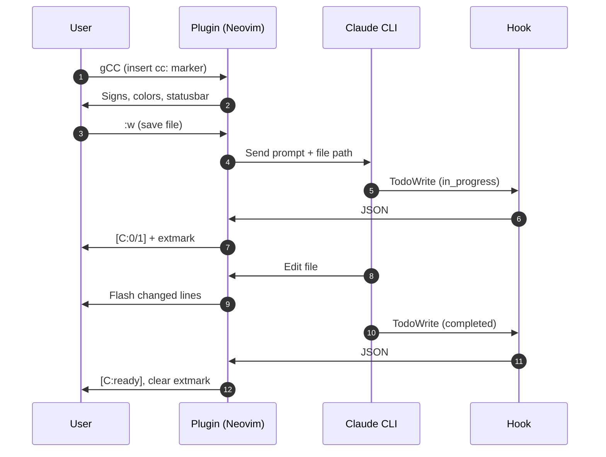

# pairup.nvim

Inline AI pair programming for Neovim.

> 🔺 Breaking Changes in v4.0 🔺
>
> This version removes the overlay system, sessions, RPC, and marker-based suggestions
> to focus on one thing: simple inline editing with `cc:`/`uu:` markers.
> See [v4-architecture.md](./v4-architecture.md) for details.
>
> Why? Less complexity, more reliability. Claude edits files directly — no parsing,
> no overlays, no state management. Just write `cc:`, save, and Claude handles it.
>
> Need the old features? Use `git checkout legacy-v3` or `git checkout v3.0.0`.

## How It Works

<<<<<<< CURRENT
Write `cc:`, `cc!:`, or `ccp:` markers anywhere in your code, save, and Claude edits the file directly.
=======
Write inline markers (`cc:`, `cc!:`, or `ccp:`) anywhere in your code. Save the file and Claude will read it, execute the instruction at each marker location, and remove the marker when done. This is a much longer line that should definitely wrap in the edit float because it contains way more text than 90 characters which is roughly the threshold we want to test for proper wrapping behavior in markdown files.
>>>>>>> PROPOSED: test conflict for wrap/width



<<<<<<< CURRENT
```lua
-- cc: add logging
-- uu: Use print, vim.notify, or a logging library?
function get_user(id)
  return db.users[id].name
end
```
=======
```lua
-- cc: add logging
-- uu: Use print, vim.notify, or a logging library?
local function get_user(id)
  if not id then return nil end
  return db.users[id] and db.users[id].name
end
```
>>>>>>> PROPOSED: add nil check and local

Save → Claude reads the file → executes the instruction → removes the marker.

See [`prompt.md`](prompt.md) for the full prompt.

## Neovim-Native Operators

Three separate operators for each marker type. Each works with any motion/text-object:

> [!NOTE]
> These keybindings are only active when pairup is loaded. They won't conflict with
> other plugins or built-in vim mappings when pairup is not in use.

<<<<<<< CURRENT
| Marker | Operator | Line | Visual |
|--------|----------|------|--------|
| `cc:` | `gC{motion}` | `gCC` | `gC` |
| `cc!:` | `g!{motion}` | `g!!` | `g!` |
| `ccp:` | `g?{motion}` | `g??` | `g?` |
=======
| Marker | Motion | Line | Visual | Description |
|--------|--------|------|--------|-------------|
| `cc:` | `gC{motion}` | `gCC` | `gC` | Execute instruction |
| `cc!:` | `g!{motion}` | `g!!` | `g!` | Constitution (saves rule) |
| `ccp:` | `g?{motion}` | `g??` | `g?` | Plan (review first) |
>>>>>>> PROPOSED: add description column

| Motion | Scope Hint | Example Output |
|--------|------------|----------------|
| `iw`/`aw` | `<word>` | `cc: <word>` |
| `iW`/`aW` | `<WORD>` | `cc: <WORD>` |
| `is`/`as` | `<sentence>` | `cc: <sentence>` |
| `ip`/`ap` | `<paragraph>` | `cc: <paragraph>` |
| `if`/`af` | `<function>` | `cc: <function>` |
| `ic`/`ac` | `<codeblock>` | `cc: <codeblock>` |
| `F` | `<file>` | `gCF` → `cc: <file>` |
| double-tap | `<line>` | `g!!` → `cc!: <line>` |
| visual | `<selection>` | captures text |

Example: Select "controller configuration" and press `gC`:
```go
// cc: <selection> controller configuration <-
// Config holds the controller configuration
```

## Signs

<<<<<<< CURRENT
Markers show in the gutter:
- 󰭻 (yellow) — `cc:` command / `cc!:` constitution / `ccp:` plan
- 󰞋 (blue) — `uu:` question marker
=======
Gutter signs:
- 󰭻 `cc:` / `cc!:` / `ccp:`
- 󰞋 `uu:` question
>>>>>>> PROPOSED: condense list

## Plan Marker (Review Before Apply)

Use `ccp:` when you want to review Claude's changes before applying them:

```lua
-- ccp: add error handling
function process(data)
  return data.value
end
```

Claude wraps changes in conflict markers:

```lua
<<<<<<< CURRENT
function process(data)
  return data.value
end
=======
function process(data)
  if not data then
    return nil, "missing data"
  end
  return data.value
end
>>>>>>> PROPOSED
```

Accept/Reject: Position cursor in the section you want to keep, then `:Pairup accept` (or `<Plug>(pairup-accept)`):
- Cursor in CURRENT → keep original (reject proposal)
- Cursor in PROPOSED → keep Claude's change (accept proposal)

**Navigation**: Use `<Plug>(pairup-proposal-next)` and `<Plug>(pairup-proposal-prev)` to jump between proposals.

**Edit view**: Use `<Plug>(pairup-proposal-edit)` to open a floating editor for the proposal at cursor. The editor shows only the PROPOSED content (editable), with CURRENT info and reason as virtual text (non-editable). A subtle backdrop dims the background for focus.

| Key | Action |
|-----|--------|
| `:w` | Sync edits to buffer |
| `q` | Close editor |
| `ga` | Accept proposal |
| `gd` | Open diff view |

**Diff view**: Use `<Plug>(pairup-conflict-diff)` to open a side-by-side diff in a new tab. Press `ga` to accept, `ge` to switch to edit view, `q` to close. Note: Opens with `diffopt+=algorithm:patience,indent-heuristic` for cleaner diffs.


Mix and match: Add `cc:` inside PROPOSED to refine before accepting:

```lua
<<<<<<< CURRENT
function process(data)
  return data.value
end
=======
-- cc: also add logging
function process(data)
  if not data then
    return nil, "missing data"
  end
  return data.value
end
>>>>>>> PROPOSED
```

Save → Claude refines the PROPOSED section → review again → accept when satisfied.

## Constitution Marker

Use `cc!:` when you want Claude to both execute an instruction AND extract the underlying rule into `CLAUDE.md`:

```lua
-- cc!: use snake_case for all variable names
local myVar = 1
```

Claude will rename `myVar` to `my_var` and add "use snake_case for variables" to your project's `CLAUDE.md`.

## Questions

When Claude needs more information, it adds `uu:` and you can continue discussion by appending `cc:` in response.

```lua
-- cc: add error handling here
-- uu: Should I use pcall or assert?
function process(data)
  return data.value
end
```

## Installation

Key bindings are optional — the plugin works with `:Pairup` commands alone.

```lua
-- lazy.nvim
{
  "Piotr1215/pairup.nvim",
  cmd = { "Pairup" },
  keys = {
    { "<leader>cc", "<cmd>Pairup start<cr>", desc = "Start Claude" },
    { "<leader>ct", "<cmd>Pairup toggle<cr>", desc = "Toggle terminal" },
    { "<leader>cq", "<cmd>Pairup markers user<cr>", desc = "Show uu: questions" },
    { "<leader>cC", "<cmd>Pairup markers claude<cr>", desc = "Show cc: markers" },
    { "<leader>cx", "<cmd>Pairup stop<cr>", desc = "Stop Claude" },
  },
  config = function()
    require("pairup").setup()
    -- Default works out of the box. Override only if needed:
    -- require("pairup").setup({
    --   providers = {
    --     claude = { cmd = "claude --permission-mode plan" },
    --   },
    -- })
  end,
}
```

## Commands

`:Pairup <subcommand>`

| Command | Description |
|---------|-------------|
| `start` | Start Claude (hidden terminal) |
| `stop` | Stop Claude |
| `toggle` | Show/hide terminal |
| `say <msg>` | Send message to Claude |
| `markers user` | Show `uu:` in quickfix |
| `markers claude` | Show `cc:`/`cc!:`/`ccp:` in quickfix |
| `inline` | Manual cc: trigger |
| `diff` | Send git diff to Claude |
| `lsp` | Send LSP diagnostics to Claude |
| `suspend` | Pause auto-processing (indicator turns red) |
| `accept` | Accept conflict section at cursor |
| `edit` | Open floating editor for proposal |
| `next` | Jump to next proposal |
| `prev` | Jump to previous proposal |

## Status Indicator

Automatically injected into lualine (or native statusline if no lualine). No config needed.

- `[C]` — Claude running
- `[C:pending]` — Waiting for Claude
- `[C:2/5]` — Todo progress (2 of 5 tasks done)
- `[C:ready]` — All tasks complete

### Progress Tracking

Track Claude Code's todo list progress via a [PostToolUse hook](https://docs.anthropic.com/en/docs/claude-code/hooks). When Claude uses TodoWrite to plan multi-step tasks, the statusline shows live progress like `[C:2/5]` and virtual text appears below your cursor showing the current task. Copy the hook script:

```bash
cp /path/to/pairup.nvim/scripts/__pairup_todo_hook.sh ~/.claude/scripts/
chmod +x ~/.claude/scripts/__pairup_todo_hook.sh
```

Add to `~/.claude/settings.json`:

```json
{
  "hooks": {
    "PostToolUse": [
      {
        "matcher": "TodoWrite",
        "hooks": [{"type": "command", "command": "$HOME/.claude/scripts/__pairup_todo_hook.sh"}]
      }
    ]
  }
}
```

Enable in pairup:

```lua
require("pairup").setup({
  progress = {
    enabled = true,
  },
})
```

Manual setup (only if you disable auto-inject or use a custom statusline plugin):
```lua
-- Disable auto-inject
require("pairup").setup({ statusline = { auto_inject = false } })

-- Add to native statusline manually
vim.o.statusline = '%f %m%=%{g:pairup_indicator} %l:%c'
```

## Configuration

Default: The `--permission-mode acceptEdits` flag is included by default. This allows Claude to edit files without prompting for confirmation on each change, which is required for the inline editing workflow to function smoothly.

All settings below are defaults. You only need to include values you want to change:

```lua
require("pairup").setup({
  provider = "claude",
  providers = {
    claude = {
      cmd = "claude --permission-mode acceptEdits",
    },
  },
  git = {
    enabled = true,
    diff_context_lines = 10,
  },
  terminal = {
    split_position = "left",
    split_width = 0.4,
    auto_insert = false,
    auto_scroll = true,
  },
  auto_refresh = {
    enabled = true,
    interval_ms = 500,
  },
  inline = {
    markers = {
      command = "cc:",
      question = "uu:",
      constitution = "cc!:",
      plan = "ccp:",
    },
    quickfix = true,
    auto_process = true, -- Auto-send to Claude on save (false = manual :Pairup inline)
  },
  statusline = {
    auto_inject = true,
  },
  progress = {
    enabled = false,
    session_id = nil, -- auto-detects from /tmp/pairup-todo-*.json
  },
  flash = {
    scroll_to_changes = false,
  },
  operator = {
    command_key = "gC",
    constitution_key = "g!",
    plan_key = "g?",
  },
})
```

### Highlight Groups

Customizable highlight groups (respects light/dark background by default):

```lua
-- In your colorscheme or after/plugin/colors.lua:
vim.api.nvim_set_hl(0, 'PairupMarkerCC', { bg = '#your_color' }) -- cc: marker line
vim.api.nvim_set_hl(0, 'PairupMarkerUU', { bg = '#your_color' }) -- uu: marker line
vim.api.nvim_set_hl(0, 'PairupFlash', { bg = '#your_color' })    -- changed lines flash
vim.api.nvim_set_hl(0, 'PairupBackdrop', { bg = '#000000' })     -- edit float backdrop
```

### Plug Mappings

Available `<Plug>` mappings for custom keybindings:

```lua
vim.keymap.set('n', '<leader>cc', '<Plug>(pairup-toggle-session)')  -- start/stop
vim.keymap.set('n', '<leader>ct', '<Plug>(pairup-toggle)')          -- show/hide terminal
vim.keymap.set('n', '<leader>cs', '<Plug>(pairup-suspend)')         -- pause auto-processing
vim.keymap.set('n', '<leader>cl', '<Plug>(pairup-lsp)')             -- send LSP diagnostics
vim.keymap.set('n', '<leader>cD', '<Plug>(pairup-diff)')            -- send git diff
vim.keymap.set('n', '<leader>cq', '<Plug>(pairup-questions)')       -- show uu: in quickfix
vim.keymap.set('n', '<leader>cC', '<Plug>(pairup-markers)')         -- show cc: in quickfix
vim.keymap.set('n', '<leader>ci', '<Plug>(pairup-inline)')          -- process cc: markers
vim.keymap.set('n', ']C', '<Plug>(pairup-next-marker)')             -- next marker
vim.keymap.set('n', '[C', '<Plug>(pairup-prev-marker)')             -- prev marker
vim.keymap.set('n', '<leader>co', '<Plug>(pairup-accept)')          -- accept conflict at cursor
vim.keymap.set('n', '<leader>cd', '<Plug>(pairup-conflict-diff)')   -- conflict diff view
vim.keymap.set('n', '<leader>ce', '<Plug>(pairup-proposal-edit)')   -- edit proposal in float
vim.keymap.set('n', ']p', '<Plug>(pairup-proposal-next)')           -- next proposal
vim.keymap.set('n', '[p', '<Plug>(pairup-proposal-prev)')           -- prev proposal
```

## Requirements

- Neovim 0.11+ 
- [Claude Code CLI](https://docs.anthropic.com/en/docs/claude-code)

## License

MIT
