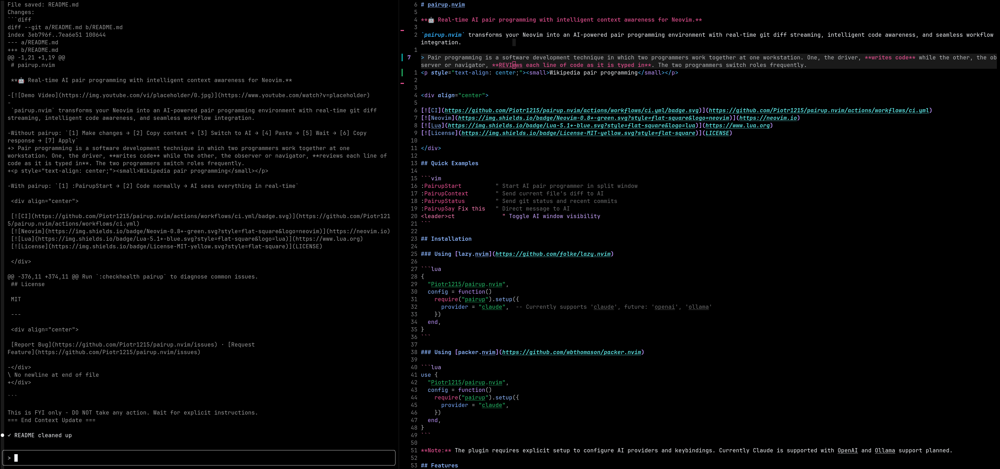

# pairup.nvim

**🤖 Real-time AI pair programming with intelligent context awareness for
Neovim.**

`pairup.nvim` transforms your Neovim into an AI-powered pair programming
environment with real-time git diff streaming, intelligent code awareness, and
seamless workflow integration.

* [Why pairup.nvim?](#why-pairupnvim)
* [Getting Started](#getting-started)
* [Installation](#installation)
* [Features](#features)
* [Neovim RPC Control](#neovim-rpc-control)
* [Configuration](#configuration)
* [Integration with Other Tools](#integration-with-other-tools)
* [Troubleshooting](#troubleshooting)
* [Requirements](#requirements)
* [FAQ](#faq)
* [License](#license)

⚠️ Warning /s
- pairup.nvim will make you useless. Claude will take over your code, your tests, your editor… and your life.
- your IQ will plummet, your job will vanish, and soon you’ll be drooling at the screen while AI zips through the tasks.
- hope you’ve got a few spare organs to sell — you’ll need them to pay rent in the post labor economics.

> Pair programming is a software development technique in which two programmers
> work together at one workstation. One, the driver, **writes code** while the
> other, the observer or navigator, **reviews each line of code as it is typed
> in**. The two programmers switch roles frequently.

<p align="center"><small>Wikipedia pair programming</small></p>



<div align="center">

[](https://github.com/Piotr1215/pairup.nvim/actions/workflows/ci.yml)
[](https://neovim.io)
[](https://www.lua.org)
[](LICENSE)

</div>

## Why pairup.nvim?

- Brings pair programming principles to AI-assisted coding - the AI observes changes as you work
- Uses existing CLI tools (Claude CLI) integrated through terminal buffers and optional RPC
- Combines two AI paradigms: agentic (autonomous) and completion-based assistance
- Git staging area controls what context is sent - staged changes are hidden, unstaged are visible
- Designed to support multiple AI providers (currently Claude, more planned)
- Purpose-built for Neovim (not a generic editor plugin)

## Getting Started

1. Start AI with `:PairupStart` - opens in vertical split
2. Make changes - AI sees unstaged diffs as you save
3. Stage completed work with `git add` - removes from AI updates
4. Continue working - AI only sees new unstaged changes

When working with the AI you can use various commands, here are some examples. See the [full commands list](#all-available-commands) below.

```vim
" Start AI and describe your task
:PairupStart
:PairupIntent I want to refactor the authentication module

" Send specific context
:PairupSay !git log --oneline -10       " Send last 10 commits
:PairupSay :LSPInfo                     " Send LSP server info
:PairupSay Can you help me optimize this function?

" Control what AI sees
:PairupToggleDiff                       " Pause automatic diff updates
" ... make many changes ...
:PairupToggleDiff                       " Resume diff updates
:PairupContext                          " Manually send accumulated changes

" Resume previous work
:PairupResume                           " Shows list of previous sessions to continue
```

### Getting started with RPC

1. Start Neovim with RPC enabled:
   ```bash
   nvim --listen 127.0.0.1:6666
   ```

2. Configure the plugin with your desired settings (see complete configuration below)


## Installation

### Using [lazy.nvim](https://github.com/folke/lazy.nvim)

```lua
{
  "Piotr1215/pairup.nvim",
  config = function()
    require("pairup").setup({
      provider = "claude",
    })
  end,
}
```

### Using [packer.nvim](https://github.com/wbthomason/packer.nvim)

```lua
use {
  "Piotr1215/pairup.nvim",
  config = function()
    require("pairup").setup({
      provider = "claude",
    })
  end,
}
```

Run `:checkhealth pairup` to verify installation.

## Features

- **Real-time Git Diff Streaming** - Automatically sends unstaged changes as you
  save
- **Neovim RPC Control** - AI can directly control your Neovim instance via RPC
- **Smart Batching** - Groups multiple saves within 1.5s to reduce noise
- **Staged/Unstaged Workflow** - Once you stage changes, they disappear from
  updates
- **Critical Notifications** - AI can alert you via `notify-send` for important
  issues
- **Auto-reload Buffers** - Files automatically refresh when AI makes edits
- **Workspace Awareness** - Shows current file diff with info about other
  changes
- **Provider Abstraction** - Extensible provider architecture
- **Intelligent Context** - Uses git staging area to track work progress
- **Periodic Updates** - Optional automatic status updates at intervals
- **Shell/Vim Command Integration** - Send command outputs directly to AI

## Neovim RPC Control

```bash
:help rpc
```

> RPC is the main way to control Nvim programmatically. Nvim implements the
> MessagePack-RPC protocol with these extra (out-of-spec) constraints:

> 1. Responses must be given in reverse order of requests (like "unwinding a
>    stack").
> 2. Nvim processes all messages (requests and notifications) in the order they
>    are received.

This enables the following scenarios.

1. Local instances with different ports - you could have multiple nvim
   instances:

- nvim --listen 127.0.0.1:6666 → RPC enabled
- nvim --listen 127.0.0.1:7777 → RPC disabled (wrong port)
- nvim → RPC disabled (no TCP server)

2. Remote servers - if you start nvim on a remote machine:

- nvim --listen 0.0.0.0:6666 (listens on all interfaces)
- nvim --listen <remote-ip>:6666
- The servername would show the actual bind address, and our detection would
  work

3. Network scenarios:

- SSH tunneling: ssh -L 6666:localhost:6666 remote-host then connect to the
  remote nvim
- Docker containers: nvim --listen 0.0.0.0:6666 inside container
- WSL/VMs: Same TCP detection works across boundaries

For remote network scenarios claude can run either locally in neovim buffer and
operate on remote neovim instance or run in remote server and operate on the
local buffer.

> [!NOTE]
> Complimentary to this setup a
> [nvim MCP server](https://github.com/calebfroese/mcpserver.nvim) can be used

### RPC Helper Methods

When RPC is enabled, Claude can use these helper functions:

```lua
require("pairup.rpc").get_context()       -- Get window layout and buffer info
require("pairup.rpc").read_main_buffer()  -- Read file content without side effects
require("pairup.rpc").execute("command")  -- Execute any Vim command
require("pairup.rpc").substitute("old", "new", "g") -- Safe text substitution
require("pairup.rpc").get_stats()         -- Get word/line counts
require("pairup.rpc").get_capabilities()  -- Discover plugins and commands
```

See [`lua/pairup/rpc.lua`](lua/pairup/rpc.lua) for full RPC documentation.

### The Staged/Unstaged Philosophy

This integration uses git's staging area intelligently:

- **Unstaged changes** = Work in progress (sent to AI)
- **Staged changes** = Completed work (hidden from updates)

This prevents repetitive large diffs - once you stage a refactor, AI only sees
new changes on top.

## Configuration

### All Available Commands

```vim
" Core Commands
:PairupStart                    " Start AI assistant in vertical split window
:PairupToggle                   " Toggle AI window visibility (hide/show)
:PairupStop                     " Stop AI assistant completely and close window
:PairupResume                   " Resume a previous Claude session (interactive picker)

" Context & Communication Commands
:PairupContext                  " Send current file's unstaged git diff to AI
:PairupStatus                   " Send git status, current branch, and recent commits to AI
:PairupFileInfo                 " Send detailed information about current file to AI
:PairupSay [message]            " Send a direct message to AI
:PairupSay ![shell cmd]         " Execute shell command and send output to AI (e.g., :PairupSay !npm test)
:PairupSay :[vim cmd]           " Execute vim command and send output to AI (e.g., :PairupSay :messages)

" Feature Toggles
:PairupToggleDiff               " Toggle automatic git diff sending on/off
:PairupToggleLSP                " Toggle LSP diagnostics sending on/off

" Session Management
:PairupIntent [text]            " Set or update the intent for current session
:PairupWipeSessions             " Clear all saved sessions
:PairupWipeSessions [pattern]   " Clear sessions matching pattern

" Directory Management
:PairupAddDir                   " Add current directory to Claude's context
```


### Complete Configuration

All available configuration options with defaults and descriptions:

```lua
require('pairup').setup({                                         
                                                                  -- AI Provider Selection
  provider = 'claude',                                            -- Currently only 'claude' is supported
                                                                  
                                                                  -- Session Management
  persist_sessions = true,                                        -- Save sessions for later resume
  prompt_session_resume = false,                                  -- Use :PairupSessions to manually select sessions
  auto_populate_intent = true,                                    -- Auto-populate intent when starting
  intent_template = "I'm planning to work on the file `%s` to...",-- Starting text to prompt claude for task
  suggestion_mode = true,                                         -- Claude only provides suggestions, doesn't edit directly
                                                                  
                                                                  -- Provider-specific configurations
  providers = {                                                   
    claude = {                                                    
      path = vim.fn.exepath('claude'),                            -- Path to Claude CLI executable
      permission_mode = 'plan',                                   -- 'plan' or 'acceptEdits' (auto-accept edits)
      add_dir_on_start = true,                                    -- Automatically add project directory on start
      default_args = {},                                          -- Additional CLI arguments
    },                                                            
                                                                  -- Future providers (not yet implemented)
    openai = {                                                    
       -- api_key = "",                                           -- OpenAI API key (future)
       -- model = "gpt-4",                                        -- Model selection (future)
    },                                                            
    ollama = {                                                    
       -- host = "localhost:11434",                               -- Ollama host (future)
       -- model = "codellama",                                    -- Ollama model (future)
    },                                                            
  },                                                              
                                                                  
                                                                  -- Git Integration
  diff_context_lines = 10,                                        -- Lines of context around changes in diffs
  enabled = true,                                                 -- Enable/disable automatic diff sending
                                                                  
                                                                  -- RPC Settings
  rpc_port = '127.0.0.1:6666',                                    -- Expected TCP port for nvim --listen
                                                                  
                                                                  -- Terminal Window Settings
  terminal = {                                                    
    split_position = 'left',                                      -- 'left' or 'right' side of screen
    split_width = 0.4,                                            -- 40% for AI, 60% for editor
    auto_insert = true,                                           -- Auto-enter insert mode in terminal
    auto_scroll = true,                                           -- Auto-scroll to bottom on new output
  },                                                              
                                                                  
                                                                  -- Filtering Settings
  filter = {                                                      
    ignore_whitespace_only = true,                                -- Ignore whitespace-only changes
    ignore_comment_only = false,                                  -- Don't ignore comment-only changes
    min_change_lines = 0,                                         -- Minimum lines changed to trigger update
    batch_delay_ms = 500,                                         -- Delay for batching multiple saves
  },                                                              
                                                                  
                                                                  -- Context Update Settings
  fyi_suffix = '\nYou have received a git diff...',               -- Message appended to context updates
                                                                  
                                                                  -- LSP Integration
  lsp = {                                                         
    enabled = true,                                               -- Enable LSP integration
    include_diagnostics = true,                                   -- Include LSP diagnostics in context
    include_hover_info = true,                                    -- Include hover information
    include_references = true,                                    -- Include reference information
  },                                                              
                                                                  
                                                                  -- Auto-refresh Settings
  auto_refresh = {                                                
    enabled = true,                                               -- Auto-refresh on external changes
    interval_ms = 500,                                            -- Check interval in milliseconds
  },                                                              
                                                                  
                                                                  -- Periodic Updates
  periodic_updates = {                                            
    enabled = false,                                              -- Send periodic status updates
    interval_minutes = 10,                                        -- Update interval in minutes
  },                                                              
})                                                                
```

### Keymaps

The plugin doesn't set default keymaps. They can be easily added like so:

```lua
-- Recommended keymaps
vim.keymap.set('n', '<leader>ct', ':PairupToggle<cr>', { desc = 'Toggle AI assistant' })
vim.keymap.set('n', '<leader>cc', ':PairupContext<cr>', { desc = 'Send context to AI' })
vim.keymap.set('n', '<leader>cs', ':PairupStatus<cr>', { desc = 'Send git status to AI' })
vim.keymap.set('n', '<leader>cm', ':PairupSay ', { desc = 'Send message to AI' })
```

### Statusline Integration

Add AI status indicator to your statusline:

```lua
-- Lualine
sections = {
  lualine_x = {
    function()
      local pairup = require('pairup.utils.indicator')
      return pairup and pairup.get() or ''
    end
  }
}

-- Native statusline
vim.opt.statusline:append('%{luaeval("require(\'pairup.utils.indicator\').get()")}')
```

## Integration with Other Tools

### Git Integration

The plugin deeply integrates with git:

```vim
" AI sees unstaged changes automatically
:w                      " Save file → AI sees diff

" Stage completed work (removes from AI view)
:!git add file.lua      " Stage → AI no longer sees

" Selective staging with AI help
:PairupSay !git diff --cached   " Show AI what's staged
:!git add -p            " AI can guide selective staging
```

### Shell Command Integration

```vim
" Send command output to AI
:PairupSay !npm test           " Test results
:PairupSay !git log --oneline  " Recent commits
:PairupSay !rg "TODO"          " Search results
```

### Vim Command Integration

```vim
" Send vim info to AI
:PairupSay :registers          " Register contents
:PairupSay :messages           " Recent messages
:PairupSay :ls                 " Buffer list
```

## Troubleshooting

### Quick health check

Run `:checkhealth pairup` to diagnose common issues.

### AI not starting?

- Check if claude CLI is installed: `:echo executable('claude')`
- Verify path in config:
  `:lua print(require('pairup.config').get().providers.claude.path)`
- Check `:messages` for errors

### Diffs not streaming?

- Ensure you're in a git repository: `:!git status`
- Check if diff sending is enabled:
  `:lua print(require('pairup.config').get().git_diff_enabled)`
- Verify file isn't ignored: Check `ignore_patterns` in config

### Commands not working?

- Ensure plugin is loaded: `:lua print(vim.g.loaded_pairup)`
- Check keybindings: `:verbose nmap <leader>ct`
- Verify setup was called: Check your plugin configuration

## Requirements

- Neovim 0.8+
- Git repository for diff tracking
- AI provider CLI (currently Claude)
- `notify-send` for system notifications (optional)

## FAQ

Q: How do I uninstall pairup.nvim?
A: You don’t. Claude will block the attempt.

Q: Who maintains this plugin?
A: Probably Claude.

Q: Is this a joke?
A: Yes. And no.

## License

xxx

MIT

---

<div align="center">

[Report Bug](https://github.com/Piotr1215/pairup.nvim/issues) ·
[Request Feature](https://github.com/Piotr1215/pairup.nvim/issues)

</div>
## 🚀 Live RPC Demo


## 🚀 Live RPC Demo

This section was added by Claude via RPC while you watched!
